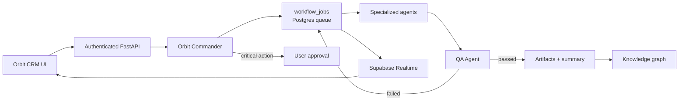

# Orbit Commander MVP

## Что реализовано

Orbit CRM использует существующий TanStack/React frontend, Supabase Auth/Postgres/Realtime и FastAPI. MVP добавляет центральный `Orbit Commander`, durable очередь в PostgreSQL, специализированных агентов, QA-цикл, approval gates, RBAC, audit log, артефакты и граф связей.



Основные модули:

- `backend/services/orbit_commander.py` — анализ, план, зависимости, назначения, approval policy, QA и финализация.
- `backend/services/workflow_worker.py` — конкурентные workers, lease через `FOR UPDATE SKIP LOCKED`, timeout и exponential retry.
- `backend/services/ai_providers.py` — provider-neutral OpenAI-compatible слой для NVIDIA, OpenAI, Groq и Ollama.
- `backend/routers/ai_workflow.py` — RBAC-защищённые API задач, планов, approvals, агентов, артефактов, графа и управления workflow.
- `supabase/migrations/20260813070444_orbit_commander_mvp.sql` — workflow/agent runs, dependencies, queue, автоматический bootstrap RBAC, audit, notifications, integration metadata, RLS и Realtime publication.
- `supabase/migrations/20260813073223_knowledge_graph_v2.sql` — универсальные узлы, автоматические связи и синхронизация сущностей CRM с графом.
- `src/features/ai-workflow/WorkflowPlanCard.tsx` — понятный план, прогресс, подзадачи и Pause/Resume/Retry/Cancel.

## Жизненный цикл задачи

1. API сохраняет исходный запрос, источник, проект, приоритет, риск, вложения и связанные сущности.
2. `Orbit Commander` формирует план. Без модели используется воспроизводимый deterministic plan; при наличии моделей работает capability-based routing с fallback.
3. Подзадачи получают исполнителей и зависимости. Готовые этапы попадают в `workflow_jobs`.
4. Каждый запуск сохраняется в `agent_runs` с input/output snapshot, моделью, usage и ошибкой без секретов.
5. Результат рабочего этапа обязательно проходит `QA Agent`. Провал возвращает конкретные замечания и автоматически ставит этап на повтор.
6. Финальный QA проверяет все этапы и артефакты. Только после этого root task получает `done`.
7. UI получает изменения через Supabase Realtime; отдельную неудачную подзадачу можно перезапустить без рестарта workflow.

## Approval policy

Обычные технические решения выполняются автоматически. Workflow останавливается только перед production deploy, merge в основную ветку, удалением данных, изменением прав, платежом/подпиской, внешней отправкой, публикацией, подключением сервиса, экспортом чувствительных данных или юридическим действием.

Запрос содержит действие, причину, риск, исполнителя, стоимость (если известна), последствия и варианты `approve`, `reject`, `request_changes`.

## Запуск

Требования: Node.js 22+, Python 3.12+, Supabase project и серверные секреты.

```bash
npm install
python3.12 -m venv .venv
source .venv/bin/activate
pip install -r backend/requirements.txt
cp .env.example .env
```

Заполнить в `.env`:

- `VITE_SUPABASE_URL`, `VITE_SUPABASE_PUBLISHABLE_KEY` — публичные frontend-настройки;
- `SUPABASE_URL`, `SUPABASE_SERVICE_ROLE_KEY`, `SUPABASE_PUBLISHABLE_KEY` — только backend;
- одинаковый `INTERNAL_API_TOKEN` для TanStack server proxy и FastAPI;
- `AI_WORKFLOW_BACKEND_URL=http://127.0.0.1:8000`;
- хотя бы один AI provider/model. Без него workflow работает в deterministic mode.

Применить миграцию к уже связанному Supabase project:

```bash
npx supabase@2.113.0 db push --linked --dry-run
npx supabase@2.113.0 db push --linked
```

Запустить frontend и backend:

```bash
npm run dev:full
```

Открыть `http://localhost:5173/ai-workflow`.

## Проверки

```bash
npx eslint src/features/ai-workflow src/routes/ai-workflow.tsx src/routes/graph.tsx src/lib/graph-data.ts src/lib/graph-repository.ts
npm run build
python -m unittest backend.tests.test_orbit_commander -v
python -m py_compile backend/services/orbit_commander.py backend/services/workflow_worker.py
```

Миграции Orbit Commander и Knowledge Graph v2 вместе проверены на чистом Supabase Postgres 17: повторный reset и `supabase db lint` проходят без schema errors, RLS включён, queue claim закрыт от browser-ролей, а новая организация автоматически получает 5 ролей, 7 permissions и 21 role-permission mapping. В старой опубликованной истории проекта есть три независимые проблемы полного reset: неверный порядок bootstrap/projects, enum/text в `simplify_task_statuses.sql` и незакрытый dollar-quote в `create_ai_user_memory.sql`. Их нельзя безопасно исправлять переименованием опубликованных миграций без согласованной repair-процедуры.

## Известные ограничения MVP

- Workers запущены внутри FastAPI-процесса. Очередь durable и поддерживает несколько replicas, но production должен гарантировать постоянный worker process.
- Подключённые AI-агенты создают model-backed/deterministic артефакты. Прямое изменение внешних GitHub/Drive/Notion ресурсов появится после подключения tool adapters и отдельных approvals.
- Pause не прерывает уже выполняющийся HTTP-запрос к модели; он останавливает выдачу следующих jobs.
- Вложения MVP сохраняются как ссылки/метаданные. Загрузка бинарных файлов в Storage требует отдельного адаптера.
- Rate limiting в MVP process-local. Для нескольких API replicas лимит нужно перенести в gateway или Redis.
- UI управления ролями/интеграциями и cost dashboard остаются этапом 2; схема, server-side RBAC и usage fields уже готовы.
- Общий `npm run lint` пока показывает старый Prettier-долг в Liam/lead-table/voice файлах, не относящихся к MVP; изменённые workflow/graph модули проходят ESLint отдельно.
